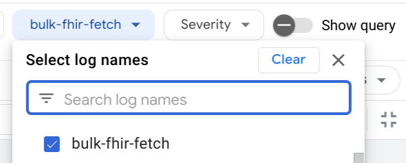

# Logs and Monitoring

By default the `bulk_fhir_fetch` ingestion tool will write logs and the final metric results to STDOUT and STDERR.

## Metric Definitions

**fhir-resource-counter**:
Count of FHIR Resources processed by `bulk_fhir_fetch`. The counter is tagged by the FHIR Resource type ex) OBSERVATION.

**fhir-rectify-counter**:
Count of FHIR Resources that do not meet the base R4 FHIR expectations and need to be rectified. The counter is tagged by the FHIR Resource type ex) OBSERVATION and type of rectification ex) MISSING_PROVIDER_REFERENCE.

**process-url-time**:
Bulk FHIR Server's provide a list of URLs to download FHIR ndjson from. process-url-time records the time in minutes, to download and process data from a particular Job URL.

**operation-outcome-counter**:
Count of the severity and error code of the [operation outcomes](https://hl7.org/fhir/R4B/operationoutcome.html) returned from the FHIR Bulk Data API.

**fhir-store-upload-counter**:
Count of uploads to FHIR Store by FHIR Resource Type and the HTTP Status returned from the FHIR Store API.

**fhir-store-batch-upload-counter**:
Count of FHIR Bundles uploaded to FHIR Store by HTTP Status returned from the FHIR Store API. This counter is applicable when the fhir_store_enable_batch_upload flag is enabled.

**fhir-store-channel-size-counter**:
The number of unread FHIR Resources that are waiting in the channel to be uploaded to FHIR Store. If this reaches the max channel size of 100 it means the write calls to FHIR Store are blocking.

**ndjson-store-channel-size-counter**:
The number of unread FHIR Resources that are waiting in the channel to be uploaded to GCS or saved locally as ndjson. If this reaches the max channel size of 100 it means the write calls to GCS are blocking.

## Sending Logs and Monitoring to GCP

Instead of STDOUT, logs and monitoring can be sent to GCP.
1. `bulk_fhir_fetch` uses the Cloud logging library to send logs to GCP. Follow the [before you begin instructions](https://cloud.google.com/logging/docs/setup/go#before_you_begin) to set up logging.

2. `bulk_fhir_fetch` uses the OpenCensus client library to send metrics to GCP. Follow the [before you begin instructions](https://cloud.google.com/monitoring/custom-metrics/open-census#prereqs) to set up monitoring.

3. Pass the `-enable_gcp_logging=true` flag when running `bulk_fhir_fetch`. You must also set the `-fhir_store_gcp_project="your_project"` flag, to specify which GCP project to send logs/metrics to.

All logs will have the log name `bulk-fhir-fetch`. In the GCP console log explorer you can filter logs by the name `bulk-fhir-fetch`.

Similarly, all metrics are prefixed with `bulk-fhir-fetch`. In the GCP console metrics explorer you can filter metrics by the name `bulk-fhir-fetch`.

 Metrics can be saved to a dashboard, and alerting can be added based on metric values.

GCP Monitoring has a sampling rate of 60 seconds. `bulk_fhir_fetch` **jobs that complete in less than 60 seconds will not show up the GCP monitoring**.